# Tanawin Maintenance

Staff tool for **Tanawin Bed & Breakfast** (Bataan): a shared queue of repairs and
problems across the property, an equipment list, preventive-maintenance schedules and
one consolidated shopping list. Replaces memory and word-of-mouth with a record that
survives staff turnover. **Not guest-facing. No cost reporting — Finance owns spend.**

Seventh app in the Tanawin family: Finance, Kitchen, Hub, Menu, Payroll, Concierge,
**Maintenance** (this one).

`SCOPE.md` records every build decision. Live at
https://tanawin-maintenance.tanawinbnb.workers.dev/ (staff login required).

## Screenshots

Everything below is **made-up data** on an in-memory stand-in for the database (fictional staff, sample photo placeholders). No real work orders, people or photos.

<table>
<tr><td align="center" width="25%">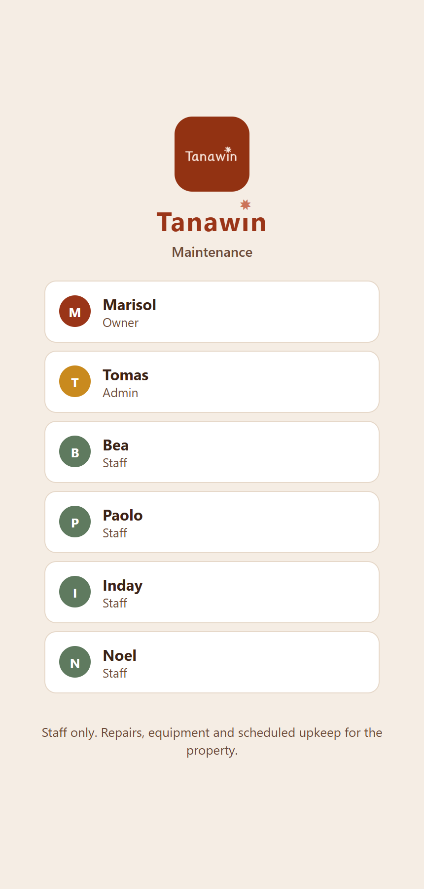<br><sub>Pick your name, enter a PIN</sub></td><td align="center" width="25%">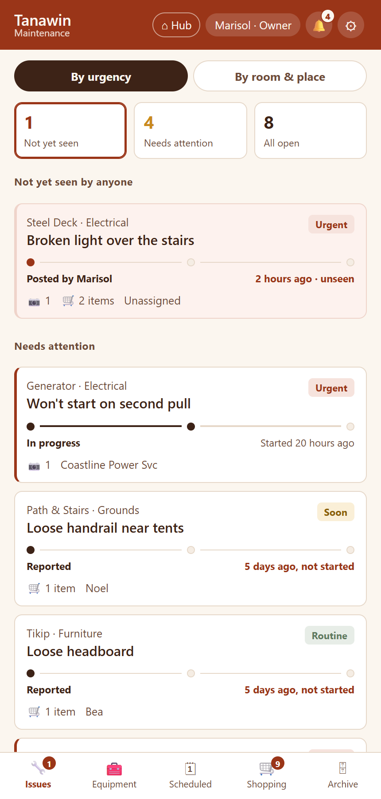<br><sub>Owner overview, by urgency</sub></td><td align="center" width="25%">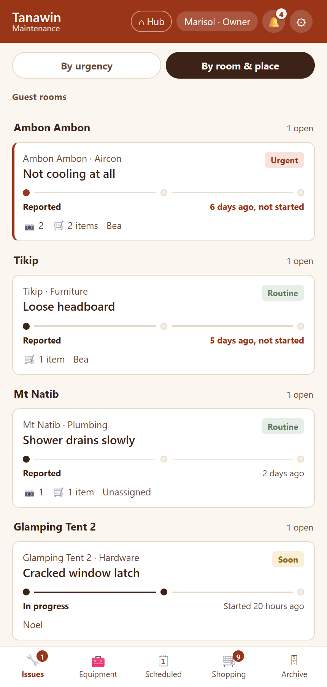<br><sub>Same queue, by room and place</sub></td><td align="center" width="25%">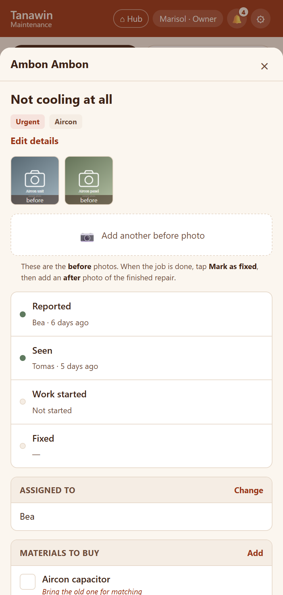<br><sub>A work order: before photos, timeline, materials</sub></td></tr>
<tr><td align="center" width="25%">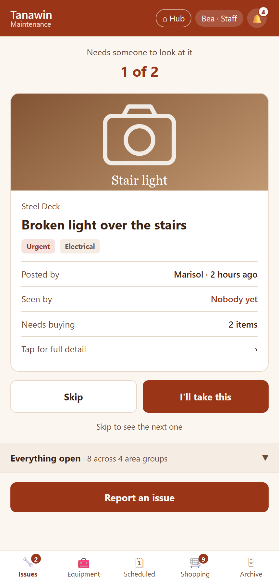<br><sub>Staff home: one card at a time</sub></td><td align="center" width="25%">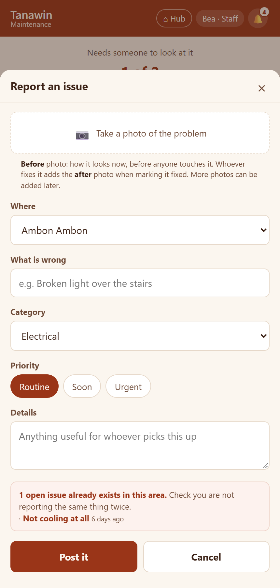<br><sub>Report an issue, with a duplicate warning</sub></td><td align="center" width="25%">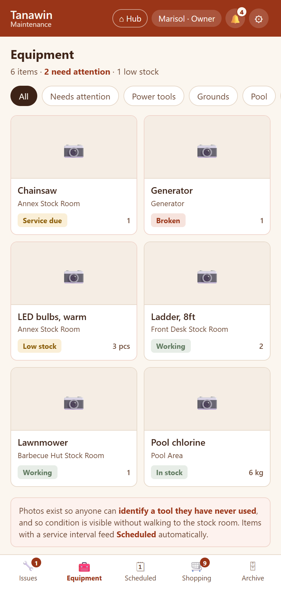<br><sub>Equipment and stock levels</sub></td><td align="center" width="25%">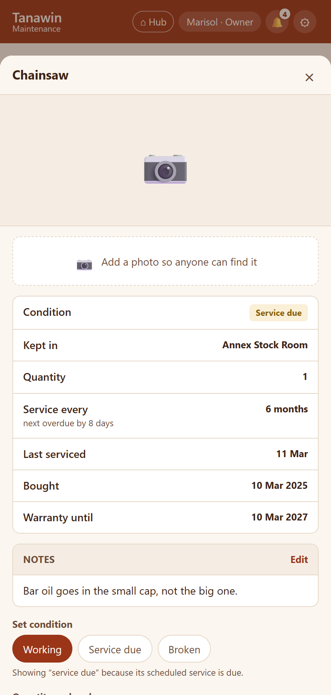<br><sub>One tool: service interval, warranty, notes</sub></td></tr>
<tr><td align="center" width="25%">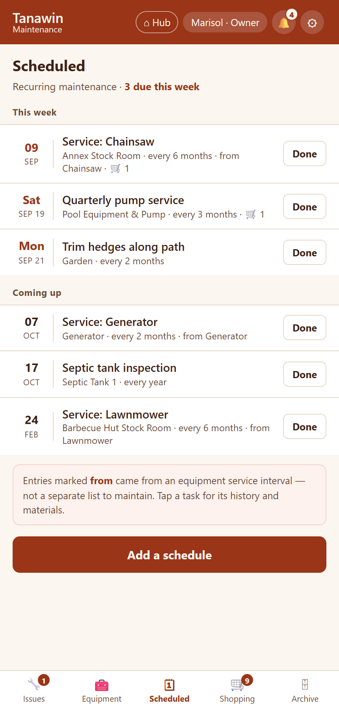<br><sub>Preventive maintenance</sub></td><td align="center" width="25%">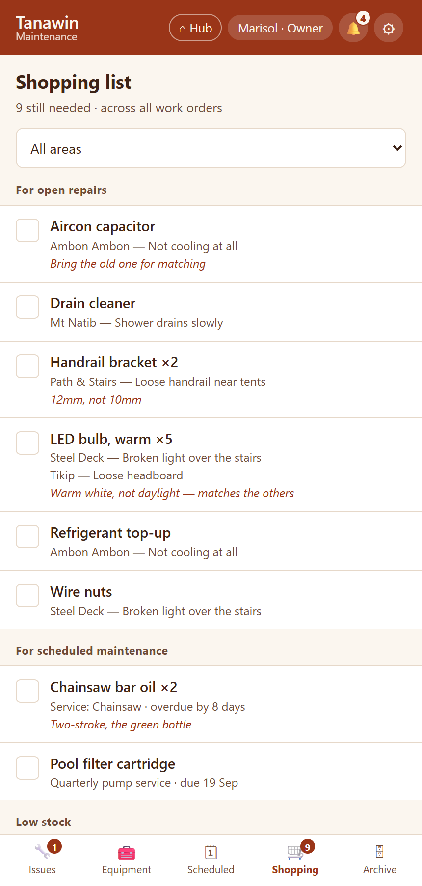<br><sub>One shopping list across every job</sub></td><td align="center" width="25%">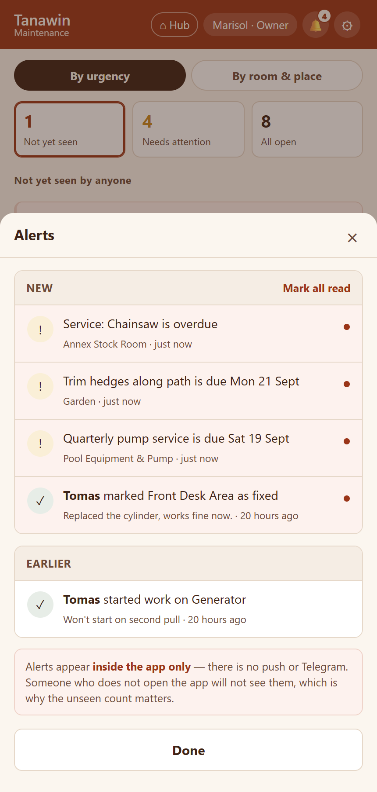<br><sub>In-app alerts</sub></td><td align="center" width="25%">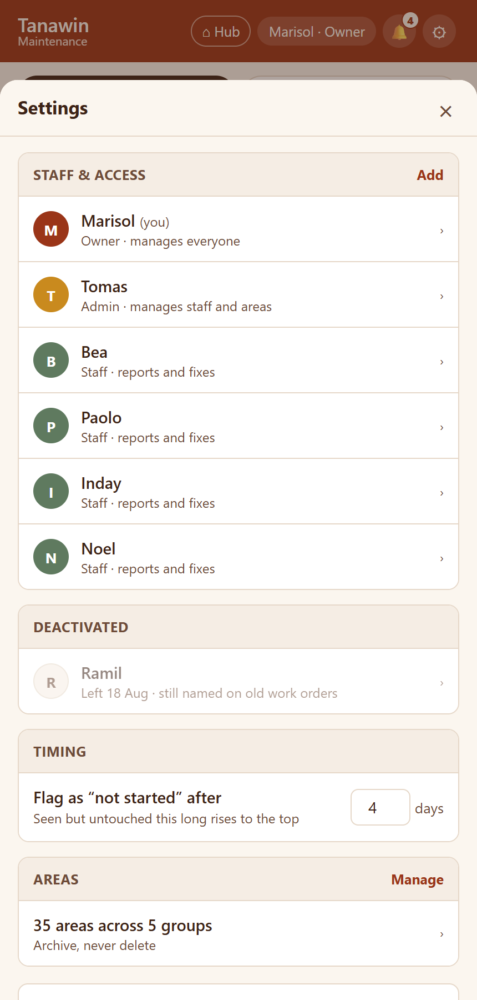<br><sub>Staff, roles and areas</sub></td></tr>
</table>

## Stack

- Vanilla HTML/CSS/JS, **no build step**. supabase-js from jsdelivr. One page
  (`index.html`) plus a printable archive month (`print.html`).
- **Its own Supabase project** (`tanawin-maintenance`): Supabase Auth, RLS on every
  table, default deny, anon has no policy anywhere. Migrations in `db/`, applied by
  `scripts/apply-sql.mjs` through the management API. Staff writes go through the
  `manage-staff` Edge Function (`supabase/functions/`), gated on the `staff` table.
- Deploys as a Cloudflare Worker with static assets from `main`
  (`wrangler.jsonc`). `_headers` carries an enforcing CSP from the first deploy.

## Login

Pick your name, enter your 4-digit PIN. Under the hood each person is a Supabase Auth
user (`<slug>@tanawin.maintenance`, password `tanawin-maintenance-v1:<pin>`); the
prefix is public, the secret is the 4 digits. Roles: **owner** (Lexi — the only role
that can change roles), **admin** (Rio — staff, areas, equipment, schedules),
**staff** (everyone else). Nobody can read a PIN; owner/admins reset, everyone can
change their own. Deactivate keeps a person greyed out on the list; Delete (owner for anyone but herself, admins for staff) removes them for good. History keeps names as text either way.

## Local dev

```
npx http-server -p 3700 -c-1 .
```

Nothing to build. `tmp/mock/` (gitignored) holds an in-memory stand-in for
supabase-js used to exercise the UI before the real project existed — open
`tmp/mock/index.html` from that server, any name, PIN `1234`.

## Database

| Table | What |
|---|---|
| `staff` | people and roles; one owner (partial unique index) |
| `settings` | one row: the "not started" threshold (the price toggle column is unused since 2026-09-16) |
| `area_groups`, `areas` | managed places (5 groups, 35 areas to start) |
| `issues` + `issue_photos`, `issue_notes`, `issue_events` | work orders; status derived from timestamps; events written by triggers |
| `items`, `item_catalog` | purchase lines per issue/schedule (name, qty, note — no prices, by decision); catalog = name suggestions |
| `equipment` | tools and consumables; a service interval owns a `schedules` row |
| `schedules`, `schedule_completions` | preventive maintenance |
| `alerts` | in-app only, written by triggers, per-person read state |

Storage bucket `photos` is private (3 MB, jpeg/webp/png); the client compresses to
≤1280px and reads by signed URL.

## Scripts

- `scripts/fill-config.mjs` — copies the public URL + anon key from `.env.local` into
  `js/config.js` and the CSP in `_headers`.
- `scripts/apply-sql.mjs <file>` — runs a migration through the management API.
- `scripts/seed-staff.mjs` — first logins with random PINs → `staff-login.txt`
  (gitignored).

Secrets live only in `.env.local` (see `SECRETS.md`).
